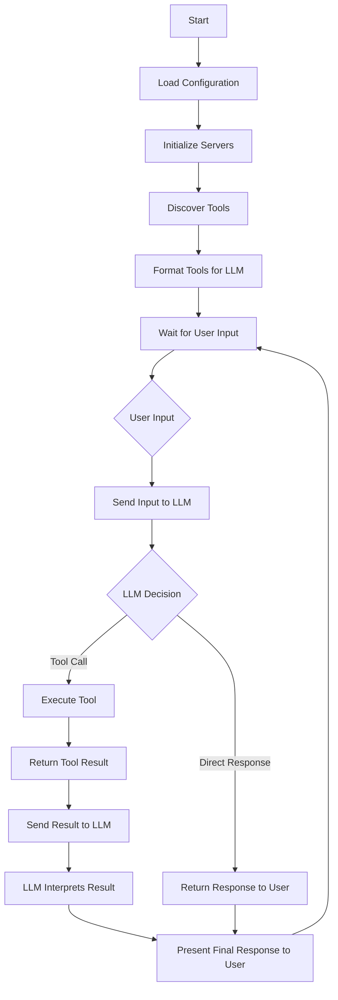

# MCP Chatbot

This chatbot example demonstrates how to integrate the Model Context Protocol (MCP) into a simple CLI chatbot. The implementation showcases MCP's flexibility by supporting multiple tools through MCP servers and is compatible with any LLM provider that follows OpenAI API standards.

If you find this project helpful, don’t forget to ⭐ star the [repository](https://github.com/3choff/mcp-chatbot) or buy me a ☕ [coffee](https://ko-fi.com/3choff).

## Key Features

- **LLM Provider Flexibility**: Works with any LLM that follows OpenAI API standards (tested with Llama 3.2 90b on Groq and GPT-4o mini on GitHub Marketplace).
- **Dynamic Tool Integration**: Tools are declared in the system prompt, ensuring maximum compatibility across different LLMs.
- **Server Configuration**: Supports multiple MCP servers through a simple JSON configuration file like the Claude Desktop App.

## Requirements

- Python 3.10
- `python-dotenv`
- `requests`
- `mcp`
- `uvicorn`

## Installation

1. **Clone the repository:**

   ```bash
   git clone https://github.com/3choff/mcp-chatbot.git
   cd mcp-chatbot
   ```

2. **Install the dependencies:**

   ```bash
   pip install -r requirements.txt
   ```

3. **Set up environment variables:**

   Create a `.env` file in the root directory and add your API key:

   ```plaintext
   LLM_API_KEY=your_api_key_here
   ```

4. **Configure servers:**

   The `servers_config.json` follows the same structure as Claude Desktop, allowing for easy integration of multiple servers. 
   Here's an example:

   ```json
   {
     "mcpServers": {
       "sqlite": {
         "command": "uvx",
         "args": ["mcp-server-sqlite", "--db-path", "./test.db"]
       },
       "puppeteer": {
         "command": "npx",
         "args": ["-y", "@modelcontextprotocol/server-puppeteer"]
       }
     }
   }
   ```
   Environment variables are supported as well. Pass them as you would with the Claude Desktop App.

   Example:
   ```json
   {
     "mcpServers": {
       "server_name": {
         "command": "uvx",
         "args": ["mcp-server-name", "--additional-args"],
         "env": {
           "API_KEY": "your_api_key_here"
         }
       }
     }
   }
   ```

## Usage

1. **Run the client:**

   ```bash
   python main.py
   ```

2. **Interact with the assistant:**
   
   The assistant will automatically detect available tools and can respond to queries based on the tools provided by the configured servers.

3. **Exit the session:**

   Type `quit` or `exit` to end the session.

## Architecture

- **Tool Discovery**: Tools are automatically discovered from configured servers.
- **System Prompt**: Tools are dynamically included in the system prompt, allowing the LLM to understand available capabilities.
- **Server Integration**: Supports any MCP-compatible server, tested with various server implementations including Uvicorn and Node.js.

### Class Structure
- **Configuration**: Manages environment variables and server configurations
- **Server**: Handles MCP server initialization, tool discovery, and execution
- **Tool**: Represents individual tools with their properties and formatting
- **LLMClient**: Manages communication with the LLM provider
- **ChatSession**: Orchestrates the interaction between user, LLM, and tools

### Logic Flow



1. **Initialization**:
   - Configuration loads environment variables and server settings
   - Servers are initialized with their respective tools
   - Tools are discovered and formatted for LLM understanding

2. **Runtime Flow**:
   - User input is received
   - Input is sent to LLM with context of available tools
   - LLM response is parsed:
     - If it's a tool call → execute tool and return result
     - If it's a direct response → return to user
   - Tool results are sent back to LLM for interpretation
   - Final response is presented to user

3. **Tool Integration**:
   - Tools are dynamically discovered from MCP servers
   - Tool descriptions are automatically included in system prompt
   - Tool execution is handled through standardized MCP protocol

## Contributing

Feedback and contributions are welcome. If you encounter any issues or have suggestions for improvements, please create a new [issue](https://github.com/3choff/mcp-chatbot/issues) on the GitHub repository.

If you'd like to contribute to the development of the project, feel free to submit a pull request with your changes.

## License

This project is licensed under the [MIT License](https://github.com/3choff/mcp-chatbot/blob/main/LICENSE).
